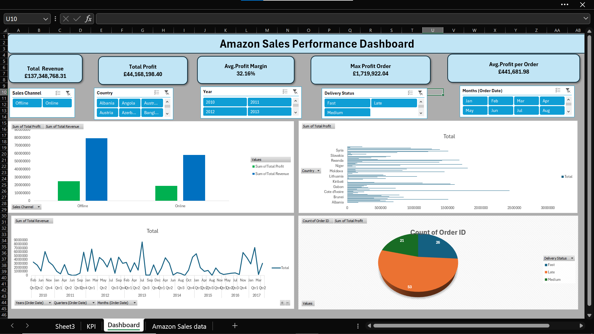

# 📊 Amazon Sales Performance Dashboard

## 🚀 Project Overview
The Amazon Sales Performance Dashboard is an interactive business intelligence project developed in Microsoft Excel to analyze sales performance, profitability, order trends, and delivery insights across multiple countries and sales channels.

This dashboard provides a comprehensive overview of key business metrics through dynamic visualizations, KPI tracking, and interactive slicers that support data-driven decision-making.

---

# 🎯 Business Objectives
- Monitor overall sales and profit performance
- Analyze revenue trends over time
- Compare Online vs Offline sales channels
- Evaluate delivery status performance
- Identify country-wise profit contribution
- Track order distribution and operational efficiency

---

# 🛠️ Tools & Technologies Used

| Tool | Purpose |
|------|----------|
| Microsoft Excel | Dashboard Development |
| Pivot Tables | Data Aggregation |
| Pivot Charts | Data Visualization |
| Slicers | Interactive Filtering |
| Conditional Formatting | KPI Highlighting |
| Data Cleaning | Data Preparation |

---

# 📌 Dashboard Features

## 📈 KPI Cards
The dashboard includes dynamic KPI indicators for:

- Total Revenue
- Total Profit
- Average Profit Margin
- Maximum Profit Order
- Average Profit per Order

---

# 📊 Visualizations Included

## 1️⃣ Sales Channel Performance
- Comparison between Online and Offline sales
- Revenue and profit analysis by channel
- Identifies most profitable sales source

---

## 2️⃣ Country-wise Profit Analysis
- Displays profit distribution across countries
- Highlights top-performing countries
- Supports regional business analysis

---

## 3️⃣ Revenue Trend Analysis
- Monthly and yearly revenue tracking
- Detects seasonal sales fluctuations
- Helps monitor long-term growth trends

---

## 4️⃣ Delivery Status Analysis
- Breakdown of Fast, Medium, and Late deliveries
- Visualizes operational efficiency
- Supports logistics performance evaluation

---

# 🎛️ Interactive Dashboard Filters

Users can dynamically filter dashboard data using slicers:

- Sales Channel
- Country
- Year
- Delivery Status
- Order Month

This enables detailed drill-down analysis and improves user interaction.

---

# 📷 Dashboard Preview

---

# 📂 Project Files

- 📄 Amazon Sales data Dashboard.xlsx
- 🖼️ dashboard.png
- 📘 README.md

---

# 🔍 Key Business Insights

- Offline sales generated higher overall revenue
- Certain countries contributed significantly to total profit
- Revenue trends showed fluctuations across different years
- Late deliveries impacted operational efficiency
- Average profit margin remained strong across orders

---

# 💡 Skills Demonstrated

- Data Analysis
- Business Intelligence
- Dashboard Designing
- Excel Reporting
- KPI Monitoring
- Data Visualization
- Interactive Reporting
- Analytical Thinking

---

# 📚 Learning Outcome

Through this project, I improved my understanding of:

- Excel Dashboard Development
- Business KPI Tracking
- Data Storytelling
- Interactive Reporting
- Sales & Profit Analysis

---

# 👨‍💻 Author

ABDUSSAMI SAYYED

📧 Email: abdussamisayyed@gmail.com  
🔗 GitHub: https://github.com/abdussamisayyed-analyst

---

# ⭐ If you found this project useful, give it a star on GitHub!
